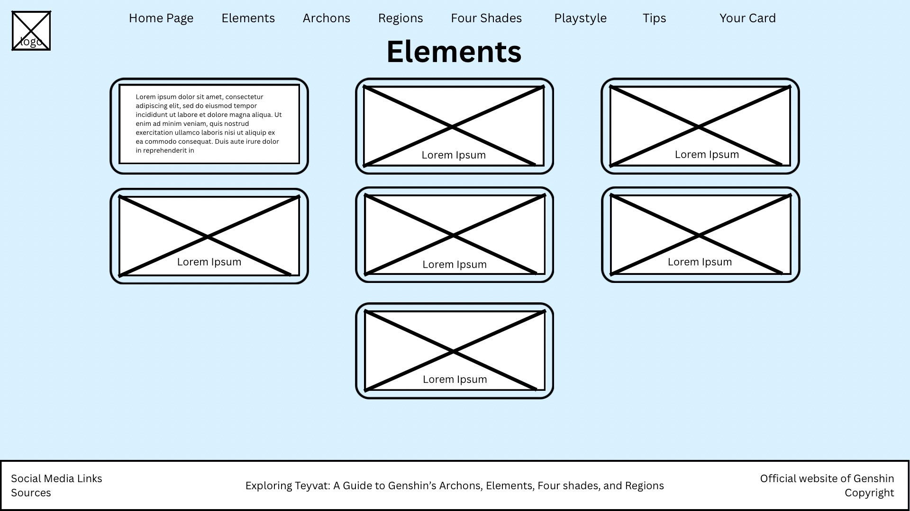
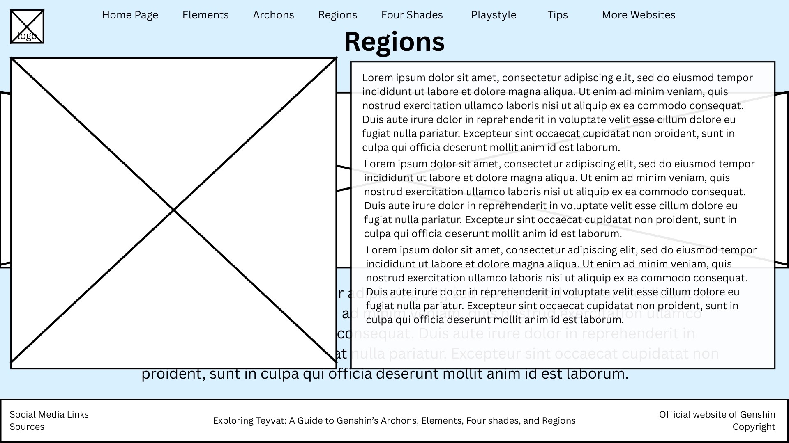
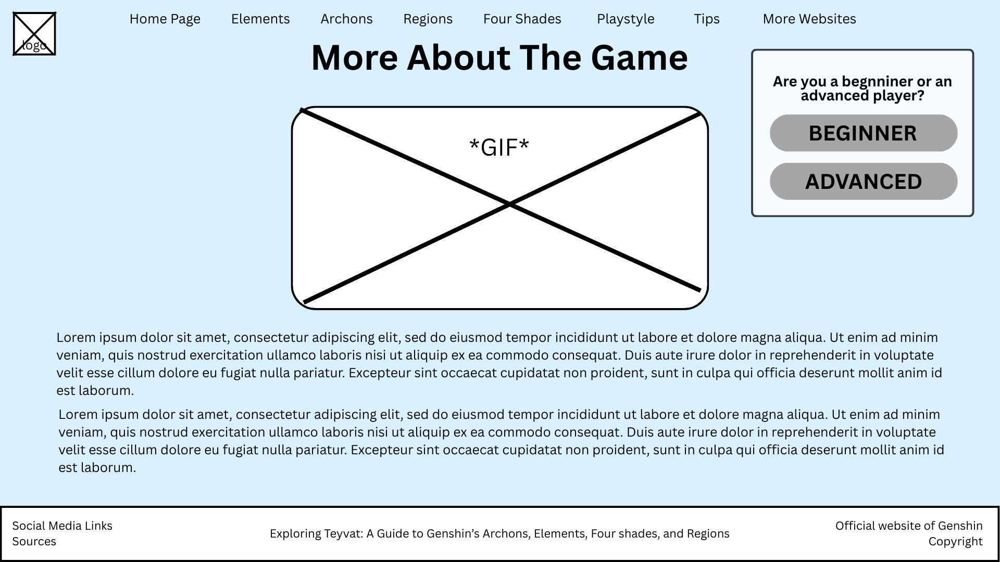
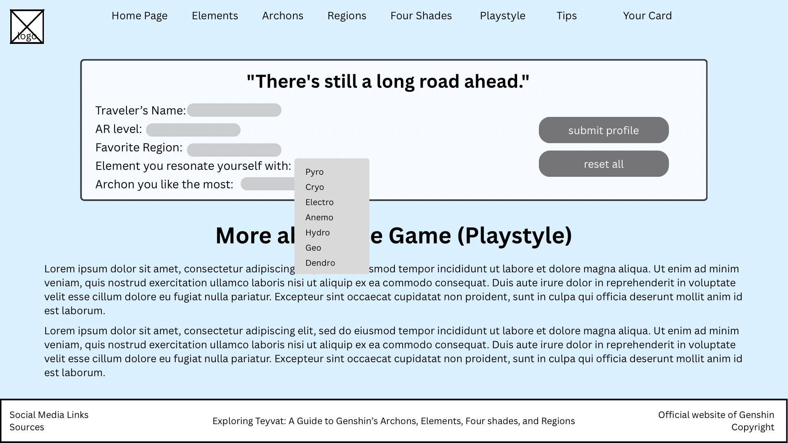
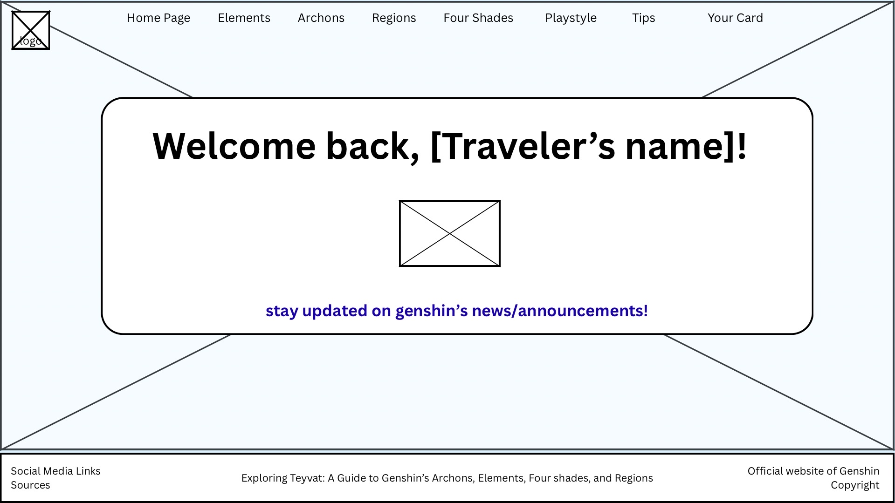

# MgRegala&Vargas Project Proposal
## Exploring Teyvat
### Exploring Teyvat: A Guide to Genshin’s Archons, Elements, Four shades, and Regions
******
#### Logo:
#### 

### Description of the website:
### This website aims to help players and the general public who are interested in learning more about the background and lore of the game Genshin Impact. It focuses on providing information about its elements, nations, archons, and the four shades. You can discover the connections between the nations, learn about the powers that shape Teyvat, and uncover details that make the game’s story and the game itself so unique and interesting. This site provides a simple and organized way to explore Genshin’s world and better understand its lore. 
******
### Outline of webpages:

### I. Page 1 - Homepage
#### The homepage introduces visitors to the website’s purpose and content. It provides:
- A brief overview of what the website offers
- Background information about Genshin Impact and its lore
- An introduction to the topics covered on the site
- An image from the game will serve as the background or main banner image for this page to capture the aesthetic and feel of Teyvat

### II. Page 2 - Elements
#### This page explains the seven different elements found in Genshin Impact (Anemo, Geo, Electro, Dendro, Hydro, Pyro, and Cryo). This page includes:
- Interactive images of each element
- Hovering or clicking on an element reveals detailed information, such as:
    - The archon associated with that element
    - Elemental reactions it can create when combined with other elements
    - Symbolic meaning and role in the game

### III. Page 3 - Archons
#### This page introduces the seven Archons who lead each nation of Teyvat. Each Archon’s profile will include:
- Names, titles, element
- The nation they rule (and in what region that nation is in)
- Significance in the lore/game

### IV. Page 4 - Regions
#### This page provides an overview of the different regions of Teyvat, each corresponding to one of the elements and archons. This page includes:
- Description of each region’s geography
- Important characters and locations
- Key events that happened in that region
- Element associated with the region
- Interactive map for better immersion

### V. Page 5 - The Four Shades
#### This page delves into the mysterious Four Shades who served the Primordial One. This page provides:
- Background and origin of the Four Shades
- Their roles in Teyvat’s creation and balance
- Theories and interpretations from the lore community
- Visuals such as images, symbols, and more will be used

### VI. Page 6. - Playstyle
#### This page talks about the playstyle of the game, while also asking some information (from the game) from the user. This page provides:
- An HTML form that asks about some info from the user like what is there traveler's name, their AR level, favorite region, and etc.
- A submit and reset button for when the user submits the info they added to the website or restart everything they chose/typed
- The implementation of the HTML form
- More information and description about the game—about its playstyle specifically

### VII. Page 7 - Tips
#### This page provides gameplay tips for the user to help them get better at the game. This page provides:
- A moving image (or a GIF) that came from the game
- Content/Descriptions/Tips on how to get better, the content also depends from the data collected from the user
- for example, if the user chose 'Raiden Shogun' as the archon they like the most, this page would provide more descriptions about her and some websites to help the user to understand the lore more

### VII. Page 8 - Traveler's Card
#### This page shows a themed card/profile of the user/traveler from the data collected from page 6. This isn't that improtant, it really just adds more design and pop to our website while also showing the user's cool and diverse theme from their choices. This page provides:
- A themed background and images depending on the user's favorite region, prefered element and archon.
- A textlink where the user will be redirected to Genshin's official website where news and announcements are uploaded there
- a floating/spinning image or gif of the element that the user has picked

### Purpose and Use of the HTML Form:
### The HTML form is designed to collect user information for the Teyvat Explorer Profile section of our Genshin Impact–themed website. Its main purpose is to allow users to create a personalized explorer profile based on their preferences in the game, such as their favorite region, element, and archon. The form is used as an interactive input for the website where users provide their details. Once submitted, the information is saved on the user’s computer and reused on other webpages of the website to display customized content. This makes the website more engaging and personalized, as users can see information that reflects their own choices and interests.
#### This feature will make use of JavaScript to:
- Handle user input and events (e.g., clicks, form submissions)
- Validate user's inputs before processing
- On other webpages of the website, JavaScript will retrieve the stored user data and use conditional statements to determine what content should be displayed
- JavaScript will also be used to dynamically update page text and sections based on the stored data
******
### Wireframes:
#### Page 1 (Home page):
#### 

#### Page 2 (Elements page):
#### 

#### Page 2 Expanded (Elements page):
#### 

#### Page 3 (Archons page)
#### 

#### Page 4 (Regions)
#### 

#### Page 4 Expanded (Regions)
#### 

#### Page 5 (The Four Shades page)
#### 

#### Page 6 (Playstyle)
#### 

#### Page 6 Expanded (Playstyle)
#### 

#### Page 7 (Gameplay Tips)
#### 

#### Page 8 (Traveler's Card)
#### 