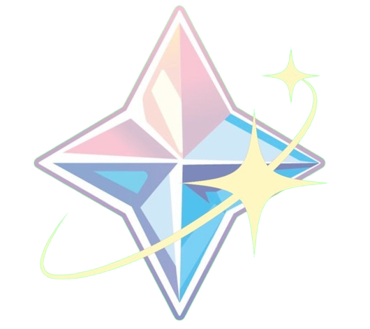
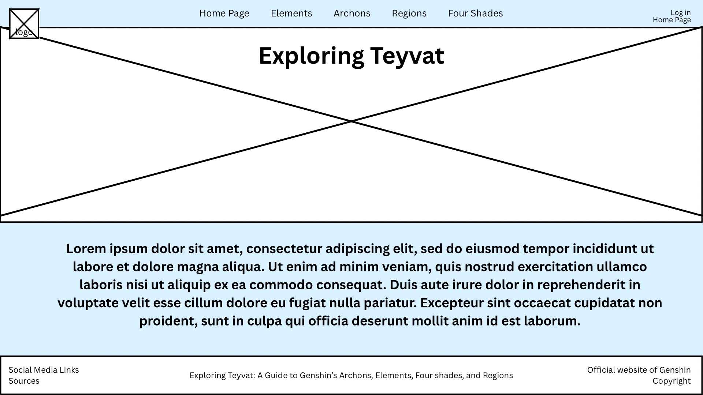
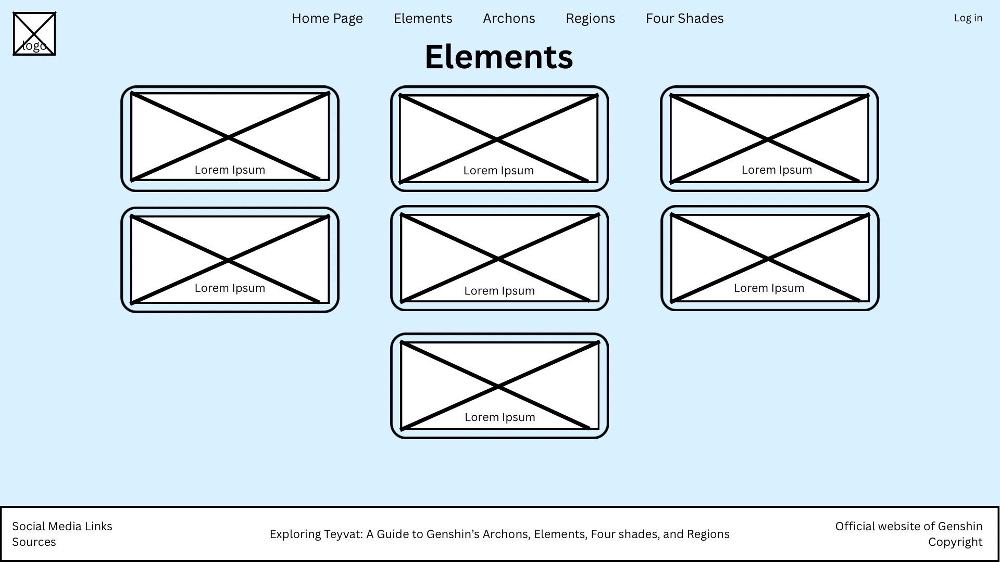
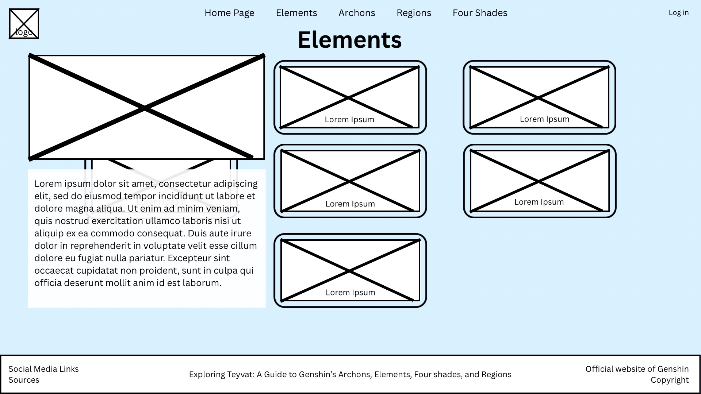
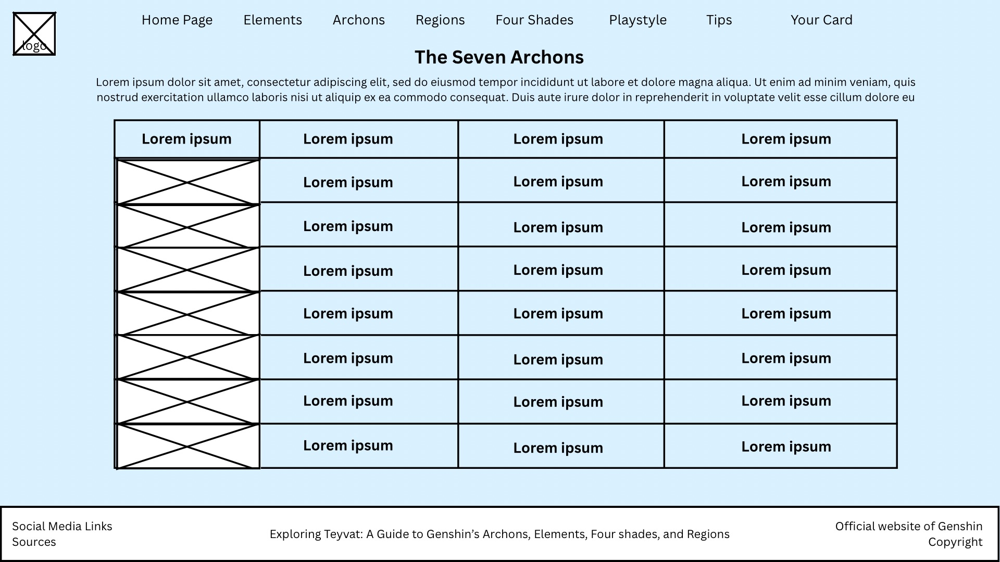
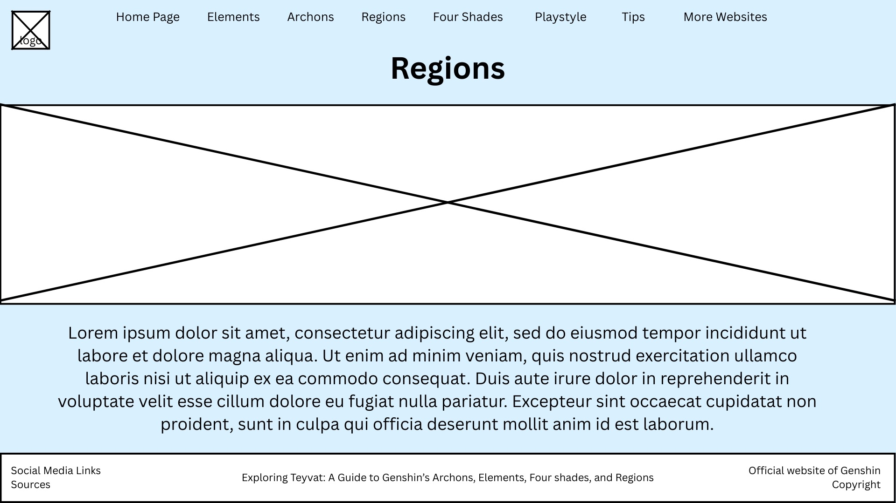
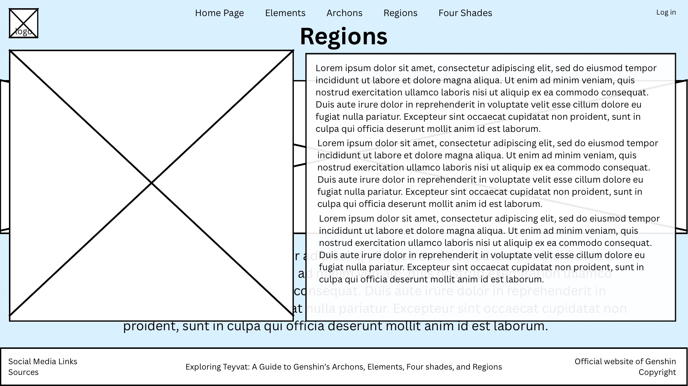
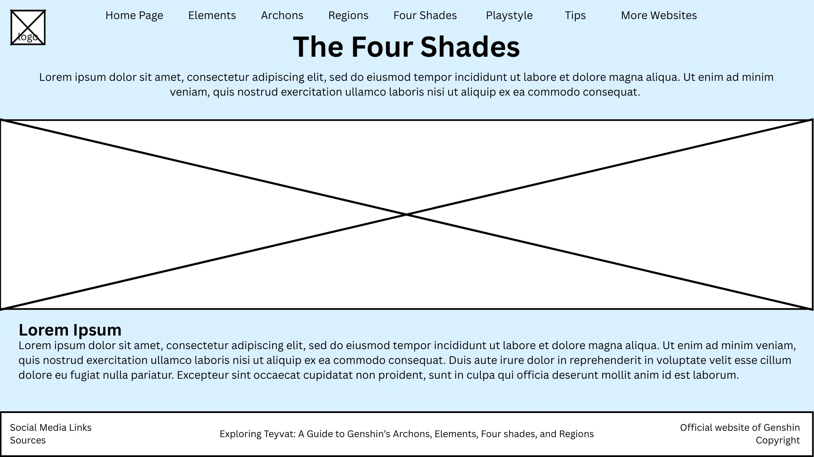

# MgRegala&Vargas Project Proposal
## Exploring Teyvat
### Exploring Teyvat: A Guide to Genshin’s Archons, Elements, Four shades, and Regions
******
#### Logo:
#### 

### Description of the website:
### This website aims to help players and the general public who are interested in learning more about the background and lore of the game Genshin Impact. It focuses on providing information about its elements, nations, archons, and the four shades. You can discover the connections between the nations, learn about the powers that shape Teyvat, and uncover details that make the game’s story and the game itself so unique and interesting. This site provides a simple and organized way to explore Genshin’s world and better understand its lore. 
******
### Outline of webpages:

### I. Page 1 - Homepage
#### The homepage introduces visitors to the website’s purpose and content. It provides:
- A brief overview of what the website offers
- Background information about Genshin Impact and its lore
- An introduction to the topics covered on the site
- An image from the game will serve as the background or main banner image for this page to capture the aesthetic and feel of Teyvat

### II. Page 2 - Elements
#### This page explains the seven different elements found in Genshin Impact (Anemo, Geo, Electro, Dendro, Hydro, Pyro, and Cryo). This page includes:
- Interactive images of each element
- Hovering or clicking on an element reveals detailed information, such as:
    - The archon associated with that element
    - Elemental reactions it can create when combined with other elements
    - Symbolic meaning and role in the game

### III. Page 3 - Archons
#### This page introduces the seven Archons who lead each nation of Teyvat. Each Archon’s profile will include:
- Names, titles, element
- The nation they rule (and in what region that nation is in)
- Significance in the lore/game

### IV. Page 4 - Regions
#### This page provides an overview of the different regions of Teyvat, each corresponding to one of the elements and archons. This page includes:
- Description of each region’s geography
- Important characters and locations
- Key events that happened in that region
- Element associated with the region
- Interactive map for better immersion

### V. Page 5 - The Four Shades
#### This page delves into the mysterious Four Shades who served the Primordial One. This page provides:
- Background and origin of the Four Shades
- Their roles in Teyvat’s creation and balance
- Theories and interpretations from the lore community
- Visuals such as images, symbols, and more will be used

### Description of how JS will be incorporated:
### JavaScript will be used to create an interactive login feature that appears on every page of the website. In the top-right corner of each page, there will be a “Log In” button. When a user clicks this button, a small pop-up or modal window will appear, allowing them to enter their username and password. Once the user submits their information, JavaScript will check the input (for example, ensuring that both fields are filled in). If the user successfully logs in, the JavaScript code will update the website’s interface to replace the “Log In” button with the user’s profile picture or avatar.
#### This feature will make use of JavaScript to:
- Handle input and output (user credentials and interface updates)
- Manage user state (logged in or logged out)
- Dynamically change the content displayed on the webpage without reloading the page
******
### Wireframes:
#### Page 1 (Home page):
#### 

#### Page 1 Expanded (Home page):
#### 

#### Page 2 (Elements page):
#### 

#### Page 2 Expanded (Elements page):
#### 

#### Page 3 (Archons page)
#### 

#### Page 4 (Regions)
#### 

#### Page 4 Expanded (Regions)
#### 

#### Page 5 (The Four Shades page)
#### 